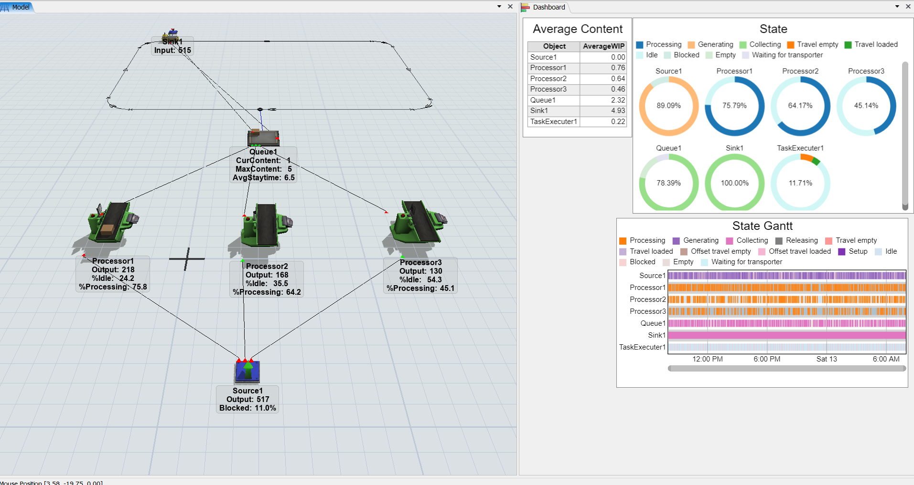
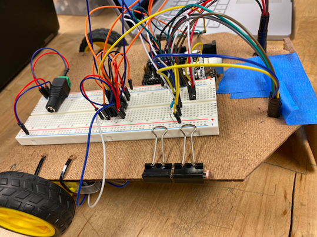
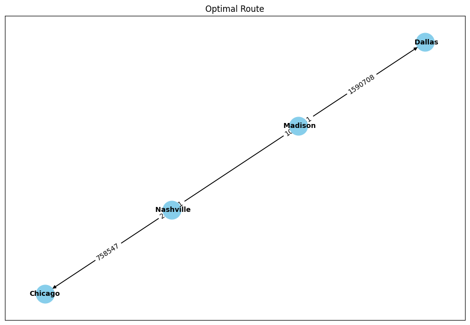

# 🏭 Inventory Optimization & Warehouse Automation

> End-to-end inventory management system combining Power BI dashboards, FlexSim warehouse simulation, an autonomous robot prototype (Arduino + SolidWorks), and shipping route optimization with Pyomo — built for E80 Group Inc.

<p align="left">
  
  
  
  
  
  
  
</p>

---

## Overview

This project integrates four interconnected modules to create a complete inventory and warehouse optimization solution:

| Module | Tool | Purpose |
|---|---|---|
| 📊 Inventory Management | Power BI | Dashboard for SKU analysis, ABC/XYZ classification, and reorder alerts |
| 🏗️ Warehouse Simulation | FlexSim | Simulate AGV transport, ASRS racking, and identify bottlenecks |
| 🤖 Autonomous Robot | Arduino + SolidWorks | Line-following robot prototype for warehouse material handling |
| 🚚 Shipping Optimization | Python + Pyomo | Optimal routing using Google Maps API and TSP solver |

---

## Module 1: Inventory Management Dashboard (Power BI)

<p align="center">
  
</p>

An interactive dashboard to monitor and analyze inventory levels across 303 SKUs.

**Key Metrics:**
- **303 SKUs** tracked with a current warehouse value of **$77.33M**
- **Inventory Turnover Ratio**: 5.42 (indicating efficient stock movement)
- **275 SKUs flagged for reordering** — critical restocking alerts
- **ABC Classification**: High-value (A), medium (B), and low-value (C) items segmented for focused management
- **XYZ Classification**: Uniform (X), variable (Y), and uncertain (Z) demand patterns for stockout prevention
- Revenue and quantity flow trends for demand forecasting

---

## Module 2: Warehouse Simulation (FlexSim)

<p align="center">
  
</p>

Simulated the full warehouse process — goods collection, AGV transportation, and ASRS (Automated Storage and Retrieval System) racking.

### Simulation in Action

<p align="center">
  
</p>

<p align="center">
  
</p>

**Key Findings:**
- **Queue2 bottleneck identified**: Average WIP of 25.32 — significantly higher than other stations, indicating a process constraint
- **Processor utilization**: Processor1 at 49.21% processing, Processor2 at 33.01%
- **Rack storage utilization**: Rack1 at 863.39 and Rack2 at 865.69 average content — near-capacity operation
- **ASRS vehicle utilization**: 12.63% active time, suggesting capacity for additional throughput
- State and Gantt chart analysis revealed idle periods and scheduling opportunities

---

## Module 3: Autonomous Robot Prototype (Arduino + SolidWorks)

<p align="center">
  
</p>

Designed and built a line-following autonomous robot for warehouse material transport.

**Hardware:**
- Arduino Uno microcontroller
- 2x DC motors with L293D motor driver
- 2x photoresistors for line detection
- MDF frame, breadboard, battery pack

**Software:** Arduino C — photoresistor-based line detection triggers motor control (stops on black line, drives forward otherwise)

**3D Design:** Full CAD drawings in SolidWorks including breadboard, wheels, and DC motor assemblies with bill of materials ($24.65 total cost, 0.828 kg total mass)

---

## Module 4: Shipping Route Optimization (Python + Pyomo)

<p align="center">
  
</p>

Solves the Traveling Salesman Problem (TSP) to find the optimal shipping route across multiple locations.

**Approach:**
- **Google Maps Distance Matrix API** for real-time distance/time data between locations
- **Pyomo** with GLPK solver for integer programming optimization
- **Subtour elimination constraints** ensure each location is visited exactly once
- **NetworkX** visualization of the optimal route

**Example Result:** Optimal route through Chicago → Nashville → Madison → Dallas minimizing total travel distance.

---

## How to Run

```bash
# Clone the repo
git clone https://github.com/patilshan/inventory-optimization-automation.git
cd inventory-optimization-automation

# --- Shipping Optimization ---
pip install pyomo networkx matplotlib pandas
# Install GLPK solver
sudo apt-get install glpk-utils    # Ubuntu
brew install glpk                   # macOS
jupyter notebook Optimization_transport.ipynb

# --- FlexSim Model ---
# Open Model.fsm in FlexSim (requires FlexSim license)

# --- Arduino Robot ---
# Upload the code from 3-D_design_Code.pdf to Arduino IDE
```

## Project Structure

```
├── bi_dashboard.png                  # Power BI inventory dashboard screenshot
├── Model.fsm                         # FlexSim warehouse simulation model
├── Model.png                         # FlexSim simulation screenshot
├── Model_Visual.png                  # FlexSim 3D model view
├── Model_video.gif                   # Simulation run recording (GIF)
├── State_Chart.png                   # Station utilization donut charts
├── State_Gantt.png                   # Gantt chart of station states
├── AVG_WIP.png                       # Average WIP table
├── Optimization_transport.ipynb      # Python shipping route optimizer
├── transport.png                     # Optimal route visualization
├── 3-D_design_Code.pdf               # SolidWorks CAD drawings + Arduino code
├── robot.png                         # Robot prototype photo
├── E80_Group_inc.pdf                 # Full project presentation
└── README.md
```

## What I Learned

- How to integrate multiple engineering disciplines (simulation, optimization, IoT, BI) into a cohesive end-to-end solution
- FlexSim simulation for identifying warehouse bottlenecks before physical implementation — Queue2's WIP of 25.32 would have been invisible without simulation
- Solving the TSP with Pyomo and subtour elimination constraints using real-world distance data from Google Maps API
- Designing and building physical prototypes with Arduino while maintaining full CAD documentation in SolidWorks

---

<p align="center">
  <a href="https://github.com/patilshan">← Back to profile</a>
</p>
